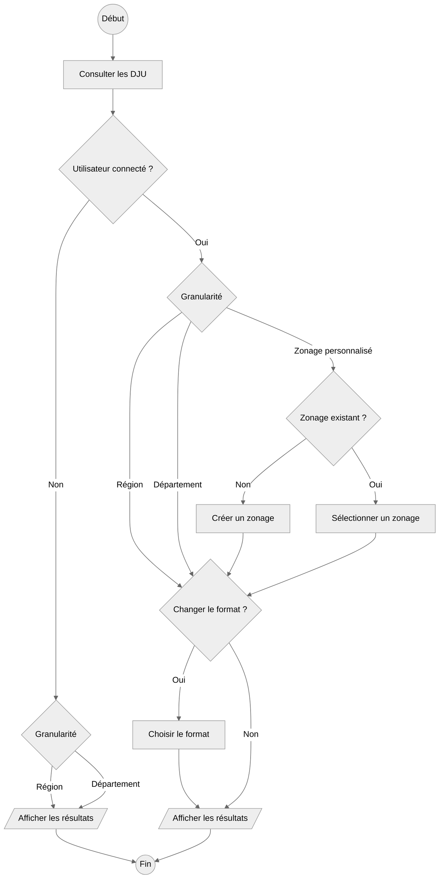

```mermaid
---
config:
  theme: neutral
  layout: dagre
---
flowchart TD
    Start((Début)) --> DJU["Consulter les DJU"]
    DJU --> TypeUser{"Utilisateur connecté ?"}

    %% Parcours Non Connecté
    TypeUser -- Non --> Gran1{"Granularité"}
    Gran1 -- Région --> Res1[/Afficher les résultats/]
    Gran1 -- Département --> Res1

    %% Parcours Connecté
    TypeUser -- Oui --> Gran2{"Granularité"}
    Gran2 -- Région --> ChangeFormat
    Gran2 -- Département --> ChangeFormat
    Gran2 -- Zonage personnalisé --> ZoneExist{"Zonage existant ?"}

    %% Gestion des zonages
    ZoneExist -- Non --> CreerZonage["Créer un zonage"] --> ChangeFormat
    ZoneExist -- Oui --> Select["Sélectionner un zonage"] --> ChangeFormat

    %% Export / Formatage
    ChangeFormat{"Changer le format ?"}
    ChangeFormat -- Oui --> ChoisirFormat["Choisir le format"] --> Res2[/Afficher les résultats/]
    ChangeFormat -- Non --> Res2

    Res1 --> Fin((Fin))
    Res2 --> Fin
```
