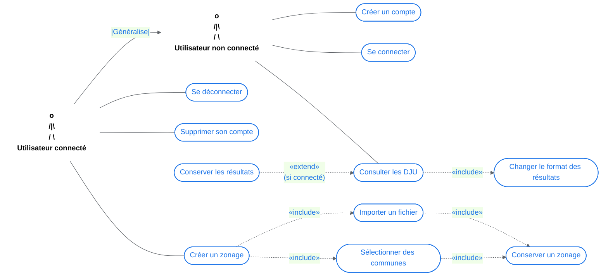

```mermaid
---
config:
  theme: base
  themeVariables:
    primaryColor: '#E8F0FE'
    primaryTextColor: '#1A73E8'
    primaryBorderColor: '#1A73E8'
    lineColor: '#5F6368'
    tertiaryColor: '#F1F3F4'
---
flowchart LR
    C["o<br>/|\<br>/ \<br>Utilisateur connecté"] -- |Généralise| --> NC["o<br>/|\<br>/ \<br>Utilisateur non connecté"]
    NC --- UC1(["Créer un compte"]) & UC2(["Se connecter"]) & UC3(["Consulter les DJU"])
    C --- UC6(["Se déconnecter"]) & UC7(["Supprimer son compte"]) & UC4(["Créer un zonage"])
    UC3 -. «include» .-> JC1(["Changer le format des résultats"])
    JC2(["Conserver les résultats"]) -. «extend»\n(si connecté) .-> UC3
    UC4 -. «include» .-> JC3(["Importer un fichier"]) & JC4(["Sélectionner des communes"])
    JC3 -. «include» .-> KC1(["Conserver un zonage"])
    JC4 -. «include» .-> KC1

     C:::noframe
     NC:::noframe
     UC1:::ucStyle
     UC2:::ucStyle
     UC3:::ucStyle
     UC6:::ucStyle
     UC7:::ucStyle
     UC4:::ucStyle
     JC1:::ucStyle
     JC2:::ucStyle
     JC3:::ucStyle
     JC4:::ucStyle
     KC1:::ucStyle
    classDef noframe fill:none,stroke:none,font-weight:bold,color:#1A73E8
    classDef ucStyle fill:#FFFFFF,stroke:#1A73E8,stroke-width:1.5px
    style C color:#000000
    style NC color:#000000
```
