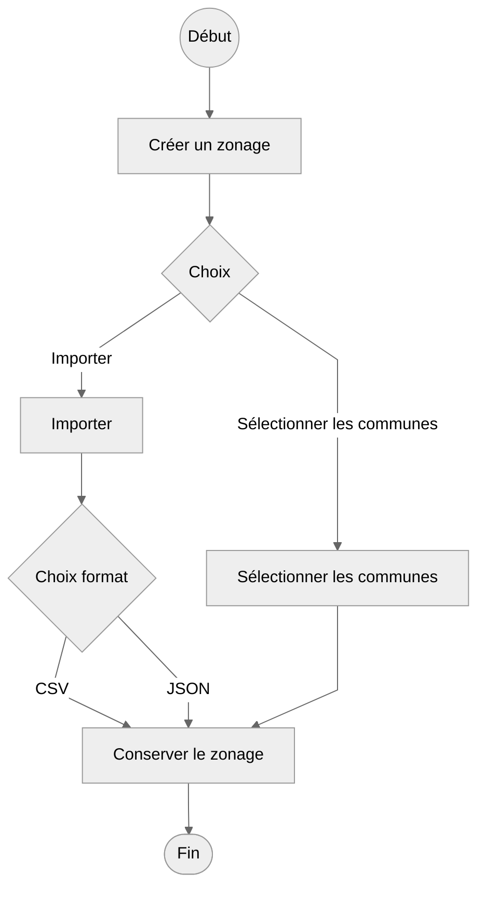

```mermaid
---
config:
  theme: neutral
  layout: dagre
---
flowchart TB
    Start((Début)) --> DJU["Créer un zonage"]
     DJU --> Choix1{"Choix"}
    Choix1 L_Choix1_Import_0@-- Importer --> Import["Importer"]
    Import --> ChoixFormat{"Choix format"}
    ChoixFormat L_ChoixFormat_Conserver_0@-- CSV --> Conserver["Conserver le zonage"]
    ChoixFormat L_ChoixFormat_Conserver_2@-- JSON --> Conserver
    SelectCom["Sélectionner les communes"] L_SelectCom_Conserver_0@--> Conserver
    Conserver --> End(["Fin"])
    Choix1 L_Choix1_SelectCom_0@-- Sélectionner les communes --> SelectCom

    L_Choix1_Import_0@{ curve: linear }
    L_ChoixFormat_Conserver_0@{ curve: linear }
    L_ChoixFormat_Conserver_2@{ curve: linear }
    L_SelectCom_Conserver_0@{ curve: linear }
    L_Choix1_SelectCom_0@{ curve: linear }
```
